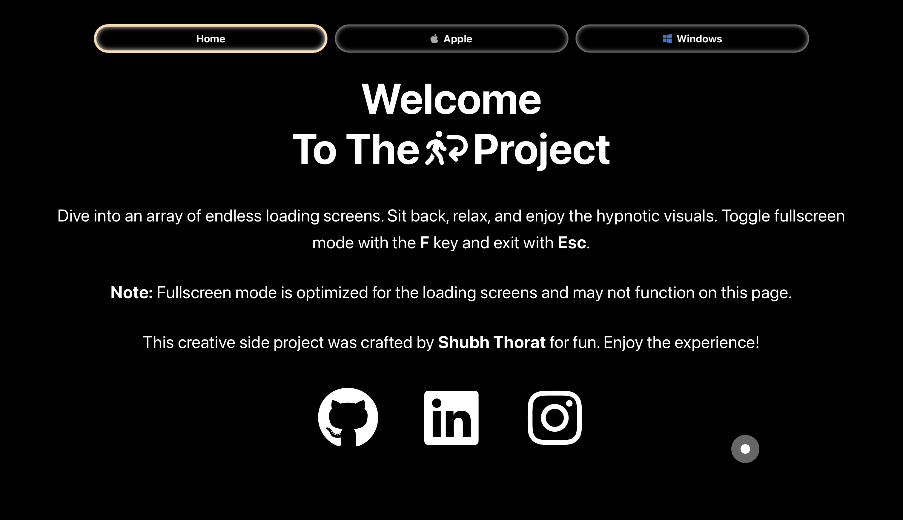
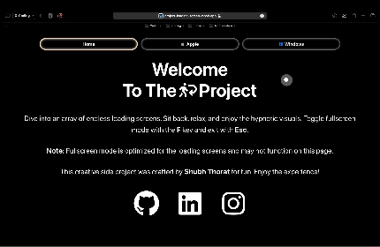

  

# Project Loading Screen
## Introduction
"Project Loading Screen" is a web-based project that offers an endless display of iconic Apple and Windows loading screens. Designed by Shubh Thorat, this project is a unique artistic interpretation of the most familiar wait screens we encounter, intended to mesmerize and engage the audience.

  

## Technology Stack
- React
- HTML
- CSS
- JavaScript

## Features
- Endless looping of Apple and Windows loading screens
- Responsive design for compatibility across various devices
- A creative and artistic take on everyday digital elements

## Usage
Simply visit the deployed application at [Project Loading Screen](https://project-loading-screen.vercel.app) and enjoy the seamless display of loading screens.

  

## License
This project is protected under a custom license. The use, reproduction, modification, or distribution of this project and its code are strictly prohibited without prior written permission from Shubh Thorat. For inquiries regarding the use or distribution of this project, please contact [reapers-arras.0y@icloud.com](mailto:reapers-arras.0y@icloud.com).

## Contact
Shubh Thorat - [reapers-arras.0y@icloud.com](mailto:reapers-arras.0y@icloud.com)

Project Link: [https://project-loading-screen.vercel.app/](https://project-loading-screen.vercel.app/)
